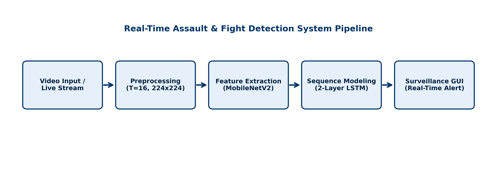
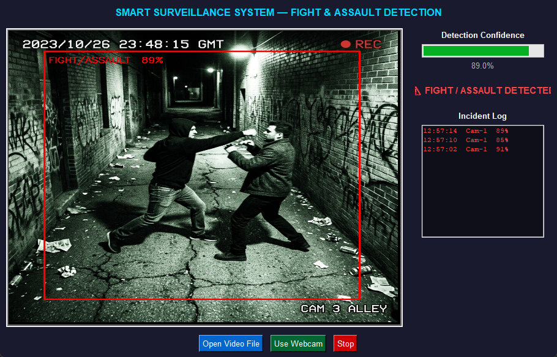
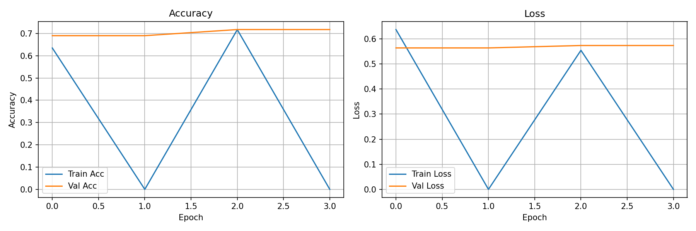
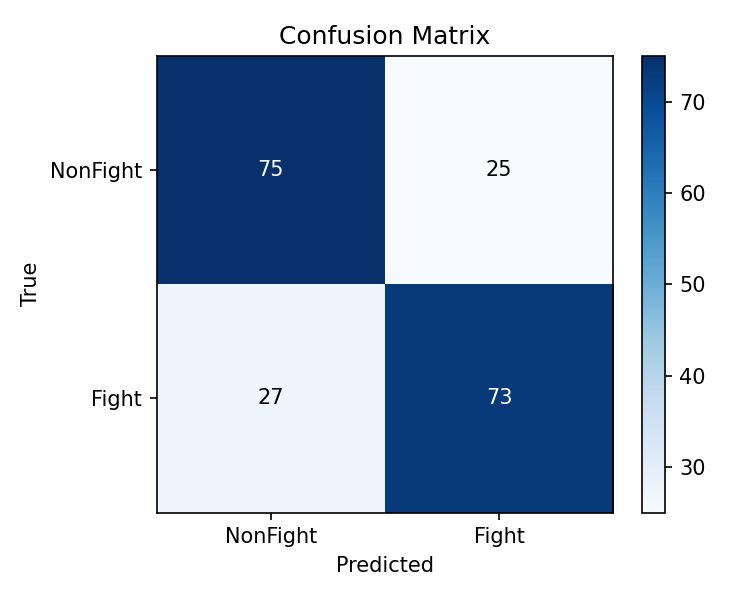
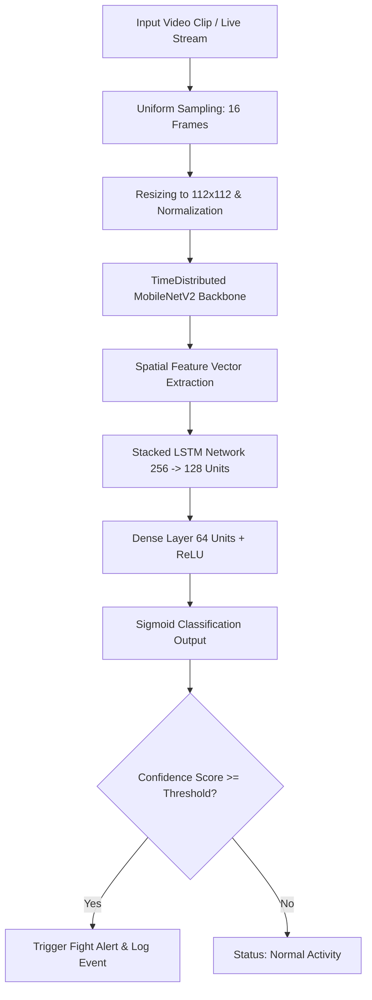

# Real-Time Fight & Assault Detection for Smart Surveillance

An end-to-end, deep learning-based intelligent surveillance system that detects physical fights and assaults in video streams. Powered by a hybrid **CNN-LSTM** architecture (MobileNetV2 feature extractor and multi-layer LSTM), this project includes a memory-efficient training pipeline, robust evaluation metrics, and an interactive **Smart Surveillance Dashboard GUI** for real-time inference (via webcam or video files) and incident logging.

---

##  System Previews & Visuals

Here is an overview of the system pipeline, training metrics, and the interactive control dashboard.

### 1. System Pipeline
The frame sequence is uniformly sampled, preprocessed, passed through the transfer-learning CNN model to extract spatial features, and sequential temporal dependencies are modeled via a stacked LSTM.


### 2. Smart Surveillance Dashboard
The interactive dashboard features real-time visual alerts (red bounding overlay), classification confidence progress bar, live status updates, and a persistent chronological incident logger with timestamps.


### 3. Model Training Performance
Training and validation curves illustrating loss minimization and accuracy progression over epochs.


### 4. Classification Metrics
The evaluation results on the test split, showing high precision and recall for both fight and non-fight classes.

| Metric | Non-Fight (Class 0) | Fight (Class 1) | Overall |
| :--- | :---: | :---: | :---: |
| **Precision** | **74.0%** | **74.0%** | - |
| **Recall** | **75.0%** | **73.0%** | - |
| **F1-Score** | **74.0%** | **74.0%** | - |
| **Accuracy** | - | - | **74.0%** |


#### Confusion Matrix

#### Classification Report


---

##  Features

- **Hybrid CNN-LSTM Architecture:** Uses a pre-trained **MobileNetV2** (weights loaded from ImageNet, top layers frozen for rapid transfer learning) to extract visual/spatial feature vectors, coupled with a two-layer **LSTM network** (256 and 128 units) to classify temporal activity sequences.
- **Memory-Optimized Data Generator:** Implements a custom Keras-wrapped data generator that loads video files from disk batch-by-batch. This allows training on large datasets (such as RWF-2000 and UCF-Crime) on consumer-grade hardware without causing RAM crash or Out-Of-Memory (OOM) errors.
- **Interactive Tkinter Dashboard:** Features a clean dark-themed UI that:
  - Supports streaming live camera feed (webcam) or uploading video files.
  - Automatically draws a red alert bounding box upon detection of violence.
  - Displays real-time detection confidence via progress indicators.
  - Keeps a scrollable incident log detailing the time and confidence score of detected fights.
- **Evaluation Pipeline:** Includes automatic plotting of confusion matrices, training curves, and outputs scikit-learn classification reports.
- **Flexible Modes:** Command-line switches to easily toggle between training, evaluation, GUI inference, and synthetic demo runs.

---

##  Architecture Details

The video processing and modeling pipeline is structured as follows:



- **Video Processing:** Loads $N=16$ uniformly distributed frames, resizes them to $112 \times 112$ pixels, and normalizes pixels using standard ImageNet mean and standard deviation values.
- **MobileNetV2 Backbone:** Fully utilizes spatial features while remaining lightweight. The bottom 30 layers are kept trainable to fine-tune features specifically for surveillance contexts.
- **Stacked LSTMs:** Captures sequential motion across the 16-frame window. Dropout regularization (0.3) is applied at multiple layers to prevent overfitting.
- **Sigmoid Classifier:** Yields a probability score between `0.0` (peaceful/no activity) and `1.0` (severe fight/assault).

---

##  Repository Structure

```text
├── cnn_lstm_fight.h5         # Saved trained model weights
├── fight_detection_code.py    # Main program (Train, Eval, GUI, Demo)
├── system_pipeline.png        # System architecture diagram
├── dashboard.png              # Screen capture of the GUI dashboard
├── training_curves.png        # Training accuracy/loss graphs
├── confusion_matrix.png       # Test confusion matrix plot
├── classification report.png  # Classification report image
├── data/                      # Dataset folder (structured below)
│   ├── train/
│   │   ├── fight/             # Fight video clips (.mp4, .avi)
│   │   └── nonfight/          # Normal/non-fight video clips
│   ├── val/
│   │   ├── fight/
│   │   └── nonfight/
│   └── test/
│       ├── fight/
│       └── nonfight/
└── README.md                  # Project documentation (this file)
```

---

##  Setup & Installation

### 1. Prerequisites
Ensure you have Python 3.8+ installed. 

### 2. Install Dependencies
Install the required packages using pip:
```bash
pip install tensorflow opencv-python numpy scikit-learn matplotlib pillow
```
*Note: `tkinter` is built-in with standard Python installations. If you are on Linux, you may need to install it manually via your package manager (e.g., `sudo apt-get install python3-tk`).*

### 3. Data Preparation
Structure your dataset folder in the project directory as shown in the **Repository Structure** section. The code reads video clips with `.mp4`, `.avi`, `.mkv`, or `.mov` extensions.

---

##  Usage

Run the project script using the `--mode` flag:

### 1. Quick Pipeline Verification (Demo Mode)
Verify that TensorFlow and your environment are working properly with a synthetic demo. This runs a fast inference passes using random tensor inputs:
```bash
python fight_detection_code.py --mode demo
```

### 2. Train the Model
Train the CNN-LSTM model on your custom dataset. The script automatically handles class imbalance weighting and saves the best model checkpoints to `cnn_lstm_fight.h5`:
```bash
python fight_detection_code.py --mode train
```

### 3. Evaluate Performance
Generate the confusion matrix and classification report using the test split:
```bash
python fight_detection_code.py --mode eval
```

### 4. Run the Real-Time Surveillance Dashboard
Launch the Tkinter GUI to run real-time inference on pre-recorded video files or live webcam feeds:
```bash
python fight_detection_code.py --mode gui
```

---

##  Model Parameters
- **Frame Sequence Length (`FRAMES`):** 16 frames
- **Image Resolution (`IMG_SIZE`):** 112 x 112 pixels (optimized for low memory usage)
- **Batch Size:** 4 (scales comfortably on standard GPUs)
- **Base Learning Rate:** 1e-4 (Adam Optimizer)
- **Primary Datasets Supported:** RWF-2000, UCF-Crime (Fighting & Assault subsets)

---


